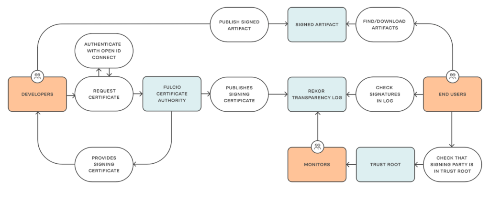
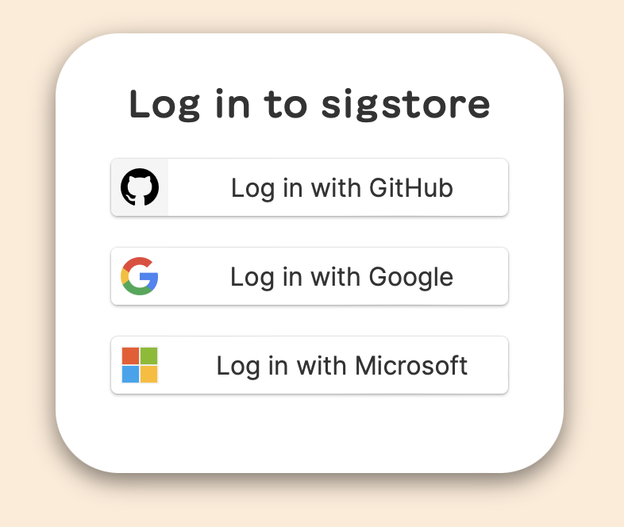
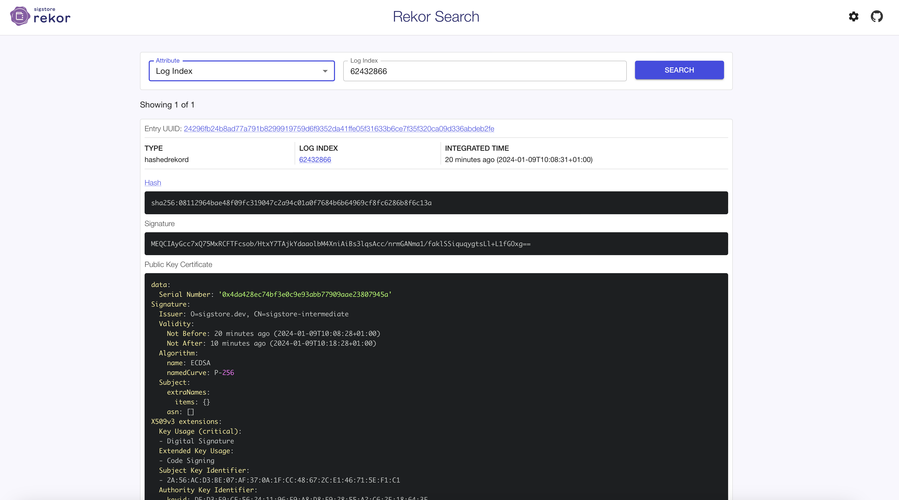

# Keyless image signing

When creating and pushing signed images to a container registry, two things are required: registry credentials and a private key. You’ve now got two problems: Securing registry credentials and securing a private key. Inevitably you’ll keep these in a similar way, a compromised device such as a developer laptop or CI system quickly negates any of the benefits of signing in the first place.

Cosign from sigstore makes the traditional signing of container images vastly easier. However, this can be taken a step further in combination with the wider sigstore products. Using Fulcio and Rekor, it's possible to sign images (and other things too) without keys and later verify them against an immutable transparency log.



Let's try to keyless sign the sunnyvaleit/my-nginx:latest container image.

```console
$ cosign sign sunnyvaleit/my-nginx:latest
Generating ephemeral keys...
Retrieving signed certificate...

        The sigstore service, hosted by sigstore a Series of LF Projects, LLC, is provided pursuant to the Hosted Project Tools Terms of Use, available at https://lfprojects.org/policies/hosted-project-tools-terms-of-use/.
        Note that if your submission includes personal data associated with this signed artifact, it will be part of an immutable record.
        This may include the email address associated with the account with which you authenticate your contractual Agreement.
        This information will be used for signing this artifact and will be stored in public transparency logs and cannot be removed later, and is subject to the Immutable Record notice at https://lfprojects.org/policies/hosted-project-tools-immutable-records/.

By typing 'y', you attest that (1) you are not submitting the personal data of any other person; and (2) you understand and agree to the statement and the Agreement terms at the URLs listed above.
Are you sure you would like to continue? [y/N] y
Your browser will now be opened to:
https://oauth2.sigstore.dev/auth/auth?access_type=online&client_id=sigstore&code_challenge=Pw1osZiMOvgM7FpgXJmOQVzMBTua2CFM_uVYSHteNBM&code_challenge_method=S256&nonce=2aiAnDNtxpiS2k7eTcSnrOceIZM&redirect_uri=http%3A%2F%2Flocalhost%3A52235%2Fauth%2Fcallback&response_type=code&scope=openid+email&state=2aiAnGPDcx5fmEFsxm1WaDCUOGZ
```

If you have done it on your laptop, a browser windows should popup prompting for an OIDC compatible authentication method:



You should have a credential on at least one of those three, in order to be recognized by Sigstore.

If the authentication went fine, going back to your terminal you should see something like:

```
tlog entry created with index: 62432866
Pushing signature to: index.docker.io/sunnyvaleit/my-nginx
```


```console
$  cosign verify sunnyvaleit/my-nginx --certificate-identity denis.maggiorotto@sunnyvale.it --certificate-oidc-issuer=https://accounts.google.com | jq .

Verification for index.docker.io/sunnyvaleit/my-nginx:latest --
The following checks were performed on each of these signatures:
  - The cosign claims were validated
  - Existence of the claims in the transparency log was verified offline
  - The code-signing certificate was verified using trusted certificate authority certificates
[
  {
    "critical": {
      "identity": {
        "docker-reference": "index.docker.io/sunnyvaleit/my-nginx"
      },
      "image": {
        "docker-manifest-digest": "sha256:1f7686d02d35bbf88e57b8157b349cc6775fb85ac837ae9410170fade95ce449"
      },
      "type": "cosign container image signature"
    },
    "optional": {
      "1.3.6.1.4.1.57264.1.1": "https://accounts.google.com",
      "Bundle": {
        "SignedEntryTimestamp": "MEUCID971j6tsfudtQnXqZ6U1zRoT06FuGHZsP9jlG/ih4UjAiEA3/EcpqKqpv+nYbmd5GZUl0yAO2yNGD3PhOpqH9Sajh4=",
        "Payload": {
          "body": "eyJhcGlWZXJzaW9uIjoiMC4wLjEiLCJraW5kIjoiaGFzaGVkcmVrb3JkIiwic3BlYyI6eyJkYXRhIjp7Imhhc2giOnsiYWxnb3JpdGhtIjoic2hhMjU2IiwidmFsdWUiOiIwODExMjk2NGJhZTQ4ZjA5ZmMzMTkwNDdjMmE5NGMwMWEwZjc2ODRiNmI2NDk2OWNmOGZjNjI4NmI4ZjZjMTNhIn19LCJzaWduYXR1cmUiOnsiY29udGVudCI6Ik1FUUNJQXlHY2M3eFE3NU14UkNGVEZjc29iL0h0eFk3VEFqa1lkYWFvbGJNNFhuaUFpQnMzbHFzQWNjL25ybUdBTm1hMS9mYWtsU1NpcXVxeWd0c0xsK0wxZkdPeGc9PSIsInB1YmxpY0tleSI6eyJjb250ZW50IjoiTFMwdExTMUNSVWRKVGlCRFJWSlVTVVpKUTBGVVJTMHRMUzB0Q2sxSlNVTXhla05EUVd3MlowRjNTVUpCWjBsVlZHRlJiemRJVXk5UVozbGxheloxTTJWUmJYRTBhbWRJYkVadmQwTm5XVWxMYjFwSmVtb3dSVUYzVFhjS1RucEZWazFDVFVkQk1WVkZRMmhOVFdNeWJHNWpNMUoyWTIxVmRWcEhWakpOVWpSM1NFRlpSRlpSVVVSRmVGWjZZVmRrZW1SSE9YbGFVekZ3WW01U2JBcGpiVEZzV2tkc2FHUkhWWGRJYUdOT1RXcFJkMDFVUVRWTlJHdDNUMFJKTkZkb1kwNU5hbEYzVFZSQk5VMUVhM2hQUkVrMFYycEJRVTFHYTNkRmQxbElDa3R2V2tsNmFqQkRRVkZaU1V0dldrbDZhakJFUVZGalJGRm5RVVZUZDBVemFWQnJWbFIwTUhvcmFEWlFRVWd3ZWpVeFl6VnJOMkUzVkRZeVVtcHRUalFLVFdFclpUQjBRVzFuUWtWWU9XRnpjR1l6V1dwVGVtdHlaMU5uY0dSNmFUazVMMXBGTHk5clprSmFjRUZLUzJKUVZqWlBRMEZZTUhkblowWTFUVUUwUndwQk1WVmtSSGRGUWk5M1VVVkJkMGxJWjBSQlZFSm5UbFpJVTFWRlJFUkJTMEpuWjNKQ1owVkdRbEZqUkVGNlFXUkNaMDVXU0ZFMFJVWm5VVlZMYkdGekNqQTNORWh5ZW1OTFNEaDRTVnA1ZW1oU2JrWmxPR05GZDBoM1dVUldVakJxUWtKbmQwWnZRVlV6T1ZCd2VqRlphMFZhWWpWeFRtcHdTMFpYYVhocE5Ga0tXa1E0ZDB4QldVUldVakJTUVZGSUwwSkRTWGRKU1VWbFdrZFdkV0ZZVFhWaVYwWnVXakpzZG1OdE9UQmtSemxCWXpOV2RXSnViREpaVjNoc1RHMXNNQXBOUTJ0SFEybHpSMEZSVVVKbk56aDNRVkZGUlVjeWFEQmtTRUo2VDJrNGRsbFhUbXBpTTFaMVpFaE5kVm95T1haYU1uaHNURzFPZG1KVVFYSkNaMjl5Q2tKblJVVkJXVTh2VFVGRlNVSkNNRTFITW1nd1pFaENlazlwT0haWlYwNXFZak5XZFdSSVRYVmFNamwyV2pKNGJFeHRUblppVkVOQ2FYZFpTMHQzV1VJS1FrRklWMlZSU1VWQloxSTVRa2h6UVdWUlFqTkJUakE1VFVkeVIzaDRSWGxaZUd0bFNFcHNiazUzUzJsVGJEWTBNMnA1ZEM4MFpVdGpiMEYyUzJVMlR3cEJRVUZDYWs4eE5pdE5TVUZCUVZGRVFVVm5kMUpuU1doQlVEUktkM2hYZEd0cVZFTkNhR2hWUldwcGNXUkRNbXRqWjBabU1WZGFZVFJGZW0xWVMwUXdDaXROWnpKQmFVVkJjVGsyYWtwWFNFdHNja3BhUmpjNFV6ZGlOV0kyVG5Ca2NrMVNhMHRrZG14dk1IQnZTVUpIUkRWbVFYZERaMWxKUzI5YVNYcHFNRVVLUVhkTlJGcDNRWGRhUVVsM1YyRmhkMU53WW1GVVlqbGhUVXQ1VGxwWGRITTBNMGQ2VVZCd1l6QXJOVGwyV1VobVJHcE1PVmszYm05SVVXRTFZeTluY1FwWVZUazRWM0o1VTBjNU0wSkJha0ZJU0d0RVVsRjBRMEprTUZWSlZuQmFTWFJvUW5Jd01rRkRja0U0SzNoVVZ6STFkRTU0ZUhGek9WcDBZalpaUjFCM0NrdzVMM0JDTmpkNlpXUllRVVpGU1QwS0xTMHRMUzFGVGtRZ1EwVlNWRWxHU1VOQlZFVXRMUzB0TFFvPSJ9fX19",
          "integratedTime": 1704791311,
          "logIndex": 62432866,
          "logID": "c0d23d6ad406973f9559f3ba2d1ca01f84147d8ffc5b8445c224f98b9591801d"
        }
      },
      "Issuer": "https://accounts.google.com",
      "Subject": "denis.maggiorotto@sunnyvale.it"
    }
  }
]
```

Signature payloads created by cosign included the digest of the container image they are attached to. By default, cosign validates that this digest matches the container during cosign verify.

```console
$ cosign verify sunnyvaleit/my-nginx --certificate-identity denis.maggiorotto@sunnyvale.it --certificate-oidc-issuer=https://accounts.google.com | jq '.[].optional.Bundle.Payload.body' | sed -e 's/"//g' | base64 -d

Verification for index.docker.io/sunnyvaleit/my-nginx:latest --
The following checks were performed on each of these signatures:
  - The cosign claims were validated
  - Existence of the claims in the transparency log was verified offline
  - The code-signing certificate was verified using trusted certificate authority certificates
{"apiVersion":"0.0.1","kind":"hashedrekord","spec":{"data":{"hash":{"algorithm":"sha256","value":"08112964bae48f09fc319047c2a94c01a0f7684b6b64969cf8fc6286b8f6c13a"}},"signature":{"content":"MEQCIAyGcc7xQ75MxRCFTFcsob/HtxY7TAjkYdaaolbM4XniAiBs3lqsAcc/nrmGANma1/faklSSiquqygtsLl+L1fGOxg==","publicKey":{"content":"LS0tLS1CRUdJTiBDRVJUSUZJQ0FURS0tLS0tCk1JSUMxekNDQWw2Z0F3SUJBZ0lVVGFRbzdIUy9QZ3llazZ1M2VRbXE0amdIbEZvd0NnWUlLb1pJemowRUF3TXcKTnpFVk1CTUdBMVVFQ2hNTWMybG5jM1J2Y21VdVpHVjJNUjR3SEFZRFZRUURFeFZ6YVdkemRHOXlaUzFwYm5SbApjbTFsWkdsaGRHVXdIaGNOTWpRd01UQTVNRGt3T0RJNFdoY05NalF3TVRBNU1Ea3hPREk0V2pBQU1Ga3dFd1lICktvWkl6ajBDQVFZSUtvWkl6ajBEQVFjRFFnQUVTd0UzaVBrVlR0MHoraDZQQUgwejUxYzVrN2E3VDYyUmptTjQKTWErZTB0QW1nQkVYOWFzcGYzWWpTemtyZ1NncGR6aTk5L1pFLy9rZkJacEFKS2JQVjZPQ0FYMHdnZ0Y1TUE0RwpBMVVkRHdFQi93UUVBd0lIZ0RBVEJnTlZIU1VFRERBS0JnZ3JCZ0VGQlFjREF6QWRCZ05WSFE0RUZnUVVLbGFzCjA3NEhyemNLSDh4SVp5emhSbkZlOGNFd0h3WURWUjBqQkJnd0ZvQVUzOVBwejFZa0VaYjVxTmpwS0ZXaXhpNFkKWkQ4d0xBWURWUjBSQVFIL0JDSXdJSUVlWkdWdWFYTXViV0ZuWjJsdmNtOTBkRzlBYzNWdWJubDJZV3hsTG1sMApNQ2tHQ2lzR0FRUUJnNzh3QVFFRUcyaDBkSEJ6T2k4dllXTmpiM1Z1ZEhNdVoyOXZaMnhsTG1OdmJUQXJCZ29yCkJnRUVBWU8vTUFFSUJCME1HMmgwZEhCek9pOHZZV05qYjNWdWRITXVaMjl2WjJ4bExtTnZiVENCaXdZS0t3WUIKQkFIV2VRSUVBZ1I5QkhzQWVRQjNBTjA5TUdyR3h4RXlZeGtlSEpsbk53S2lTbDY0M2p5dC80ZUtjb0F2S2U2TwpBQUFCak8xNitNSUFBQVFEQUVnd1JnSWhBUDRKd3hXdGtqVENCaGhVRWppcWRDMmtjZ0ZmMVdaYTRFem1YS0QwCitNZzJBaUVBcTk2akpXSEtsckpaRjc4UzdiNWI2TnBkck1Sa0tkdmxvMHBvSUJHRDVmQXdDZ1lJS29aSXpqMEUKQXdNRFp3QXdaQUl3V2Fhd1NwYmFUYjlhTUt5TlpXdHM0M0d6UVBwYzArNTl2WUhmRGpMOVk3bm9IUWE1Yy9ncQpYVTk4V3J5U0c5M0JBakFISGtEUlF0Q0JkMFVJVnBaSXRoQnIwMkFDckE4K3hUVzI1dE54eHFzOVp0YjZZR1B3Ckw5L3BCNjd6ZWRYQUZFST0KLS0tLS1FTkQgQ0VSVElGSUNBVEUtLS0tLQo="}}}}%   
```

Rekor has also a web-based search service, just go to https://search.sigstore.dev and search your signing using one of the following params:

- email
- hash
- commit SHA
- entry UUID
- log index

for example:



